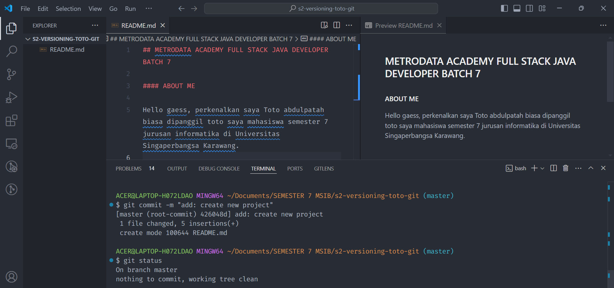
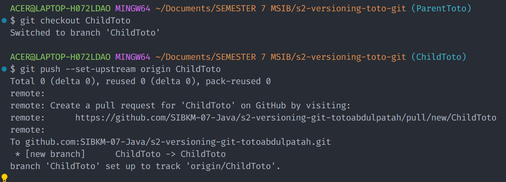

## Hello SIBKM Java Batch 7 🔥

### Saya Toto Abdulpatah Berikut Report dari tugas 1 : Versioning

### Implementasi Fast Forward

##### 1.

##### 2.

##### 3.

##### 4.

##### 5.

##### 6.

##### 7.

##### 8.

##### 9.

##### 10.

##### 11.

##### 12.

##### 13.

##### 14.

##### 15.

##### 16.

### Implementasi Three Way Merge

##### 1.

##### 2.

##### 3.

##### 4.

##### 5.

##### 6.

##### 7.

##### 8.

##### 9.

##### 10.

##### 11.

##### 12.

##### 13.

##### 14.

Semangat...

pasti tetap semangat...

### belajar three way merge - main

### belajar three way merge - develop
